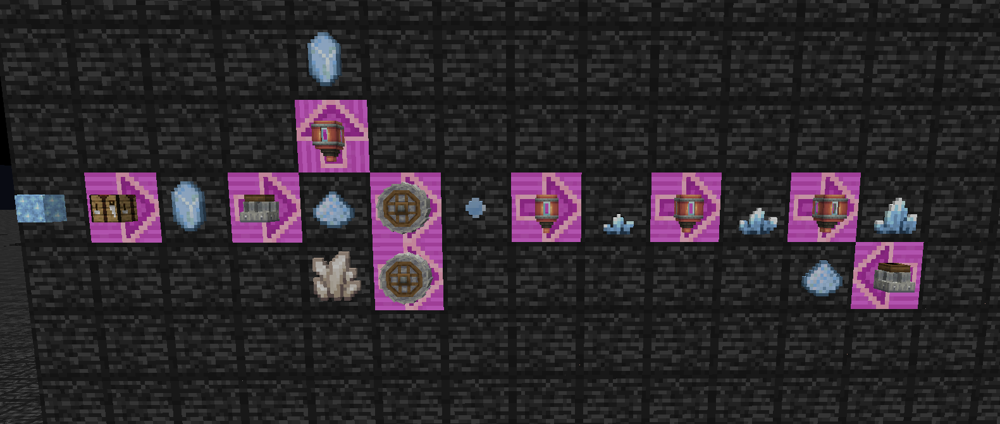
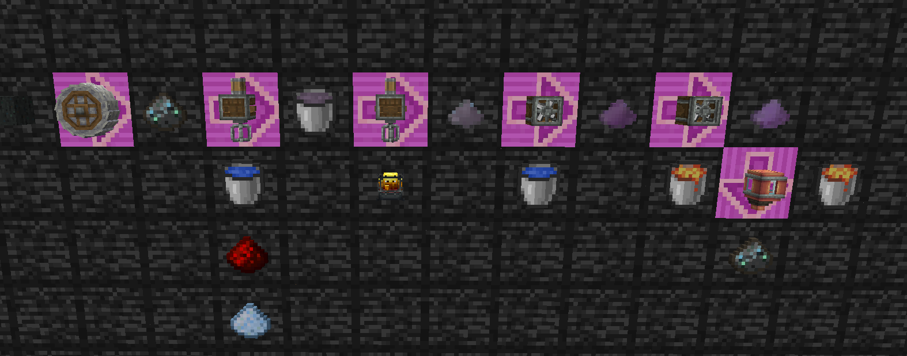

## Kube.js recipes for game with  `AE2` + `Create` + `Twilight Forest`

> This copy of recipes is under CC 4.0. You should follow the same LICENSE if you REDISTRIBUTE, MODIFY or USING the copy of the code

This custom recipes provide some regenerate method for `certus quartz` and `sky stone` using the methods provided by create mod.

1. regenerate method for certus quartz dust

2. regenerate method for sky stone

